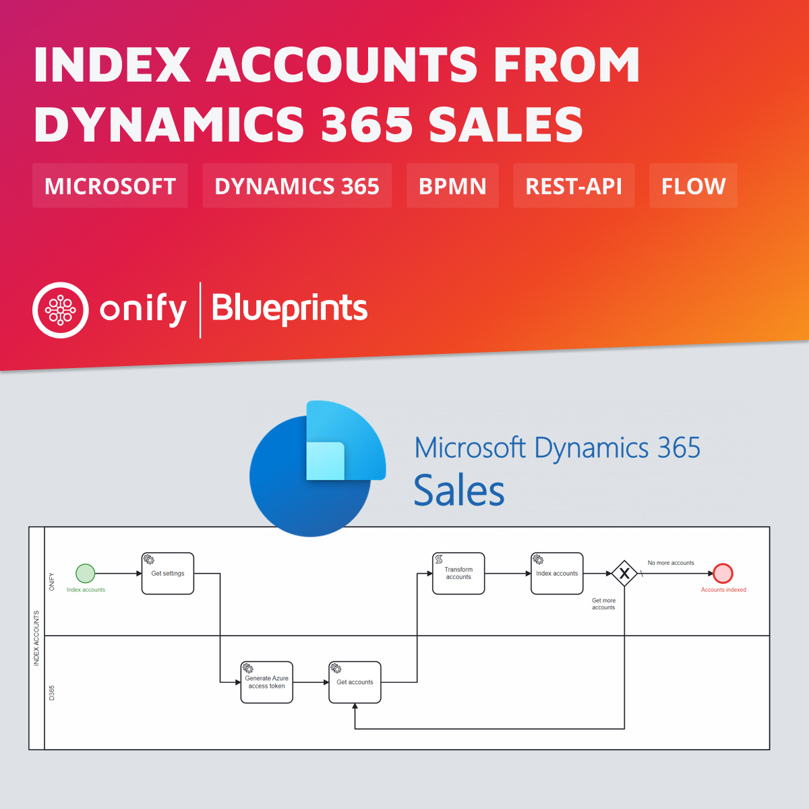

[](https://www.repostatus.org/#wip)


# Onify Blueprint: Index accounts from Dynamics 365 Sales

[Microsoft Dynamics 365 Sales](https://dynamics.microsoft.com/sales/overview/) is a cloud-based CRM solution, purposely designed and built to support sales teams, and sits on the Microsoft Dynamics 365 Customer Engagement Platform. The solution allows businesses to qualify leads, manage sales opportunities, build relationships, structure and automate elements of the sales process and more.

In this Blueprint we show how we can index accounts from Dynamics 365 Sales using REST-API integration.



## Requirements

* [Onify Hub](https://github.com/onify/install)
* [Camunda Modeler](https://camunda.com/download/modeler/)
* [Dynamics 365 Sales](https://dynamics.microsoft.com/sales/overview/)

## Included

* 1 x Flow

## Setup

### Microsoft

There are 2 parts to this setup

1. App registration (Registering an App in Active Directory). Please follow [these instructions](https://d365demystified.com/2022/03/06/setup-postman-to-connect-to-dynamics-365-crm-using-oauth-2-0-azure-app-registration/), section *Register an App in Azure* ( name the app `Onify Web API` instead ;-) )
2. Add CRM application user
   1. Go to `https://admin.powerplatform.microsoft.com/environments/<ENVIRONMENTID>/appusers` (where `<ENVIRONMENTID>` is your Dynamics 365 CRM environment id)
   2. Add your newly created app as a app user (and add appropriate security roles)

### Onify

Add the following settings.

|Key|Name|Value|Type|Tag|Role|
|---|----|-----|----|---|----|
|azure_credentials|Microsoft Azure credentials|``` { "tenant": "<TENANTID>", "client_id": "<CLIENTID>",	"client_secret": "<CLIENTSECRET>"}```|object|dynamics365, frontend|admin|
|dynamics365_url|Dynamics 365 CRM url|`https://<ORGID>.<CRMNR>.dynamics.com`|string|dynamics365, frontend|admin|

> Note: Creating settings via admin interface add a trailing `_` in key. This is required for flow to work.

## Test

1. Open the BPMN diagram in Camunda Modeler.
2. Deploy the BPMN diagram (click `Deploy current diagram` and follow the steps).
3. Run it (click `Start current diagram`).

## Support

* Community/forum: https://support.onify.co/discuss
* Documentation: https://support.onify.co/docs
* Support and SLA: https://support.onify.co/docs/get-support

## License

This project is licensed under the MIT License - see the [LICENSE](LICENSE) file for details.